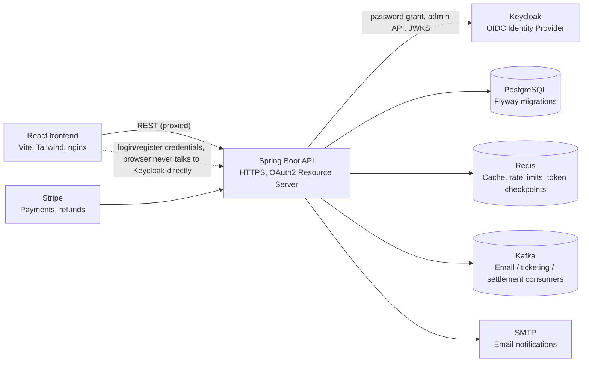

# Clausis Reserve — Backend

*Read the full engineering deep dive on Medium: [Engineering Clausis Reserve](https://medium.com/@Nihadhiyan/engineering-clausis-reserve-a-journey-through-high-concurrency-multi-tenancy-and-stateless-12da6f1e8726)*

*Frontend repository: [Reservation_System_Frontend](https://github.com/Nihadhiyan/Reservation_System_Frontend.git)*

A Spring Boot backend for a multi-tenant exhibition/stall reservation platform — venues, halls, floor layouts, pricing, stall reservations, Stripe payments, settlement, and notifications, secured with Keycloak-issued OIDC access tokens and running entirely over HTTPS.

## Architecture



The frontend never talks to Keycloak directly — it still posts `username`/`password` to this API's own `/api/v1/auth/*` endpoints exactly as before. The backend exchanges those credentials with Keycloak (Resource Owner Password Credentials grant) and returns Keycloak-issued tokens. Every other request carries a `Bearer` access token that this API validates locally against Keycloak's JWKS (no network call to Keycloak per request) and re-derives authorization from its own database. See **Authentication & Access Control** below for why it's built this way.

## Tech Stack

- **Java 21**, **Spring Boot 3.3.13**
- **Spring Web**, **Spring Data JPA**, **Spring Security** (OAuth2 Resource Server, stateless)
- **Keycloak 24** — OIDC Identity Provider (self-hosted; see note on cloud IdPs below)
- **PostgreSQL 16** (Docker/`prod`) / **H2** (`dev`, in-memory)
- **Flyway** for database migrations
- **Redis** — caching, IP/user rate limiting, refresh-token blacklist and "security checkpoint" revocation
- **Apache Kafka** (KRaft mode) — async email, ticketing (QR confirmation), and settlement processing
- **Thymeleaf** for email templates
- **Stripe** for payments (checkout + webhooks)
- **MapStruct** + **Lombok** for DTO mapping and boilerplate reduction
- **ZXing** for QR code generation
- **Spring Boot Actuator + Micrometer/Prometheus/Zipkin** for observability
- **JJWT** — still used, but only for the app's own single-purpose tokens (password reset, email verification, org invites); session login tokens are Keycloak's

## Authentication & Access Control

This app was migrated from self-issued JWTs to **Keycloak (OIDC)** as the identity provider. The design goal was to make Keycloak the source of truth for "is this really a valid, currently-active credential" while keeping every existing authorization rule (`@PreAuthorize`, `OrganizationSecurityEvaluator`) untouched.

**Login/registration flow** (`AuthController` → `AuthService`):
1. The frontend posts `username`/`password` to `POST /api/v1/auth/login` (or `/register`) — no UI or contract change from a plain-JWT setup.
2. `AuthService` checks the local brute-force lock (`LoginAttemptService`, Redis-backed) *before* ever contacting Keycloak.
3. It exchanges the credentials with Keycloak via the **Resource Owner Password Credentials grant** (`KeycloakIdentityService`, server-to-server only — the browser never sees Keycloak's URL or talks to it directly).
4. Keycloak's response (a signed, RS256 access token + refresh token) is returned to the frontend as-is.
5. On registration, the backend also provisions a matching Keycloak user via the Admin REST API (client-credentials grant, `manage-users` role on the client's service account) and keeps a local BCrypt password hash in sync purely so `changePassword`'s "confirm your current password" check doesn't need a Keycloak round trip — Keycloak's copy is what actually gates login.

**Every subsequent request** carries `Authorization: Bearer <token>`. Spring's built-in OAuth2 Resource Server support verifies the token's signature against Keycloak's JWKS endpoint (fetched lazily, cached) and checks expiry — no network call to Keycloak on the hot path. A custom `KeycloakJwtAuthenticationConverter` then:
- Reads the token's `email` claim and looks up the corresponding **local** `User` row (Keycloak proves *who* the caller is; it is never trusted for *what they're allowed to do*).
- Re-derives Spring Security authorities fresh from the database on every request — `ROLE_<SystemRole>` plus `ORG_<orgId>_<OrganizationRole>` for each organization membership — in the exact string format `OrganizationSecurityEvaluator` already expects.
- Enforces per-token revocation (`isAccessTokenBlacklisted`, set on logout) and a "security checkpoint" (invalidates every token issued before a given instant — used for forced logout / role changes), both Redis-backed and both ported over from the pre-Keycloak filter.

**Role model.** The platform has two portal-facing roles, `SUPER_ADMIN`/`CUSTOMER` (`SystemRole`) as the platform-level role, and per-organization capabilities (`OrganizationCapability`: `ORGANIZES_EVENTS`, `OPERATES_STALLS`, `OWNS_VENUES`) combined with an org-level role (`ORG_ADMIN`/`ORG_MEMBER`, `OrganizationRole`). An **Exhibition Organizer** is an organization with the `ORGANIZES_EVENTS` capability; a **Stall Vendor** is an organization with `OPERATES_STALLS`. Access control is enforced with method-level `@PreAuthorize` (see `ReservationController`, `EventController`) backed by `OrganizationSecurityEvaluator`, which resolves ownership/membership from the authenticated principal — never from any client-supplied ID.

**On a cloud-hosted IdP.** Keycloak here runs self-hosted in Docker for local development and grading (`docker-compose.yml`'s `keycloak` service). The architecture is IdP-agnostic at the boundary that matters (`spring.security.oauth2.resourceserver.jwt.jwk-set-uri` + `KeycloakProperties`), so pointing it at a cloud-hosted Keycloak instance, or swapping in Auth0/Okta/Asgardeo, is a configuration change (issuer/JWKS URL, client ID/secret), not a code change — `KeycloakIdentityService`'s three integration points (token endpoint, admin API, logout endpoint) are standard OIDC/Keycloak REST API paths.

## Security Notes (OWASP Top 10)

- **Injection (A03)**: All persistence goes through Spring Data JPA/Hibernate with parameterized queries — no string-concatenated SQL anywhere in the codebase.
- **Broken Authentication (A07)**: Credential verification is fully delegated to Keycloak (industry-standard OIDC, RS256-signed tokens, no shared HMAC secret between issuer and verifier). Brute-force lockout (`LoginAttemptService`) runs *before* Keycloak is even contacted. Tokens are short-lived (5 minutes) with server-side revocation (blacklist + security checkpoint) for immediate logout, not just eventual expiry.
- **Broken Access Control (A01)**: Every mutating/sensitive endpoint carries `@PreAuthorize`, evaluated against the server-derived principal — the request never supplies "who I am," only "what I want to do." See `OrganizationSecurityEvaluator` for the full ownership-resolution logic.
- **Cryptographic Failures (A02)**: PII fields (contact numbers, addresses) are encrypted at the JPA layer with AES-GCM and a random IV per value (`PiiEncryptionConverter`) — encrypted, not just masked, at rest. The API itself is TLS-only (see below); passwords are BCrypt-hashed locally and never logged.
- **Security Misconfiguration (A05)**: `ddl-auto=validate` (never `update`/`create`) so schema drift fails loudly at startup instead of silently auto-mutating production data. CORS is explicitly configured (`app.cors.allowed-origins`), not wildcarded. CSRF protection is deliberately disabled (`SecurityConfig`) — this is a stateless, cookie-free Bearer-token API, so there is no ambient browser credential (session cookie) for a forged cross-site request to ride on; CSRF only matters for cookie-based auth.
- **Vulnerable Components (A06)**: Dependency versions are pinned via the Spring Boot BOM plus explicit versions for security-relevant libraries (JJWT, Stripe SDK).
- **Server-Side Request Forgery / SSRF**: The backend's only outbound calls are to fixed, configuration-driven endpoints (Keycloak, Stripe, SMTP) — no user-supplied URL is ever fetched.

## Transport Security (HTTPS)

The API serves **HTTPS only** (`server.ssl.enabled=true`), backed by a self-signed certificate at `src/main/resources/keystore/keystore.p12` (CN=`localhost`, SAN=`localhost`+`127.0.0.1`). Plain HTTP requests to the same port are rejected outright, not silently allowed through.

Regenerate the certificate if it expires or you want your own:
```bash
keytool -genkeypair -alias clausis -keyalg RSA -keysize 2048 -storetype PKCS12 \
  -keystore src/main/resources/keystore/keystore.p12 -validity 3650 \
  -dname "CN=localhost" -ext "SAN=dns:localhost,ip:127.0.0.1"
```
Because it's self-signed, browsers/`curl` will warn on it — that's expected for local HTTPS and doesn't mean the connection isn't encrypted; it means the certificate isn't chained to a public CA. For a real deployment, swap `key-store`/`key-store-password`/`key-alias` in `application.yml` for a CA-issued certificate.

## Project Structure

```
src/main/java/com/bookfair/backend/
├── model/                # JPA entities
├── config/                # Security (SecurityConfig, KeycloakProperties), CORS, cache, async, scheduling, Stripe
│   └── filter/             # IpBlastShieldFilter, UserQuotaFilter, MaintenanceModeFilter
├── controller/             # REST controllers
├── dto/                    # Request/response DTOs + MapStruct mappers, grouped by domain
├── event/                  # Domain/application events (cache, hierarchy, reservation, payment, user...)
├── listener/                # Event listeners (audit, cache eviction, notifications, security)
├── consumer/ / producer/     # Kafka consumers (email, ticketing, settlement) and producers
├── exception/               # Custom exceptions + global exception handler
├── integration/              # External integrations (Stripe payment gateway, email channel)
├── repository/               # Spring Data JPA repositories
├── security/                 # JwtService (single-purpose tokens), JwtAuthEntryPoint, org-level security evaluator
│   └── keycloak/               # KeycloakIdentityService, KeycloakJwtAuthenticationConverter
├── service/                  # Business logic, including pricing strategies
└── converter/                 # JPA attribute converters (PII encryption)

src/main/resources/
├── application.yml            # Base configuration (env-var driven)
├── application-dev.properties  # H2, dev-only overrides
├── application-prod.properties # PostgreSQL + strict TLS overrides
├── keystore/keystore.p12        # Self-signed HTTPS certificate
├── db/migration/                 # Flyway migration scripts — see "Database" below
└── templates/email/                # Thymeleaf email templates

docker/keycloak/realm-export.json  # Pre-provisioned Keycloak realm, client, and roles
```

## API Overview

All endpoints are versioned under `/api/v1` (except Stripe webhooks under `/api/payments`).

| Base path | Responsibility |
|---|---|
| `/api/v1/auth` | Register, login, refresh, logout, email verification, password reset (public) |
| `/api/v1/users` | User profile and account management |
| `/api/v1/organizations`, `/api/organizations/invites` | Organizations, membership, invites |
| `/api/v1/venues`, `/api/v1/buildings`, `/api/v1/floors`, `/api/v1/halls`, `/api/v1/stalls` | Venue hierarchy CRUD (list/detail endpoints are public for browsing; writes require auth) |
| `/api/v1/layout`, `/api/v1/layout-markers` | Floor-plan layout and stall grid generation |
| `/api/v1/events`, `/api/v1/event-stalls` | Events and per-event stall configuration (list/detail are public) |
| `/api/v1/genres` | Book genre management |
| `/api/v1/pricing` | Pricing rules and price breakdown calculation |
| `/api/v1/reservations` | Stall reservations |
| `/api/v1/payments`, `/api/payments` (webhook) | Payment processing and Stripe webhooks |
| `/api/v1/admin` | Admin dashboard and system configuration |

**Public without a token**: `/api/v1/auth/**`, `/actuator/health/**`, and the read-only browse surface (`GET /api/v1/events`, `/api/v1/events/{id}`, `/api/v1/events/{id}/stalls`, `/api/v1/venues`, `/api/v1/venues/{id}`, `/api/v1/venues/{id}/buildings`) so a visitor can explore exhibitions before creating an account. Everything else requires a valid Keycloak-issued Bearer token, and the rest of `/actuator/**` additionally requires the `SUPER_ADMIN` role.

## Getting Started

### Prerequisites

- **Docker + Docker Compose** (recommended path — brings up everything below for you)
- Java 21 and Maven (only needed for the local, non-Docker path)
- A Stripe account (test keys are sufficient)

### Configuration

Nothing in this repo requires editing a file to run locally — every credential and connection setting is an environment variable with a dev-safe default, matching the assessment's config-file/12-factor requirement. **Override every default below before any real deployment.**

| Variable | Default (dev/Docker) | Purpose |
|---|---|---|
| `JWT_SECRET` | *(dev placeholder)* | Signing key for the app's own reset/verify/invite tokens (not login sessions — those are Keycloak's) |
| `PII_SECRET_KEY` | *(dev placeholder)* | AES-GCM key for encrypting PII fields at rest |
| `STRIPE_SECRET_KEY` / `STRIPE_WEBHOOK_SECRET` | `sk_test_dummy` / `whsec_dummy` | Stripe API + webhook signature verification |
| `SMTP_PW` | `dummy_password` | Password for the SMTP account in `application.yml` (`spring.mail.username`) |
| `KEYCLOAK_SERVER_URL` | `http://localhost:8081` (`http://keycloak:8080` in Docker) | Base URL of the Keycloak server |
| `KEYCLOAK_JWK_SET_URI` | derived from the above | Where the resource server fetches Keycloak's signing keys |
| `KEYCLOAK_REALM` / `KEYCLOAK_CLIENT_ID` | `clausis-realm` / `clausis-backend` | Must match `docker/keycloak/realm-export.json` |
| `KEYCLOAK_CLIENT_SECRET` | `clausis-backend-secret` | Confidential client secret — matches the realm export for local use only |
| `SSL_KEYSTORE_PASSWORD` | `changeit` | Password for the bundled self-signed HTTPS keystore |
| `SPRING_PROFILES_ACTIVE` | `dev` (`docker` in Compose) | Active Spring profile |
| `DB_URL` / `DB_USER` / `DB_PASSWORD` | H2 in-memory | Database connection (Compose sets its own Postgres URL directly) |
| `CORS_ORIGINS` | `http://localhost:5173` | Allowed frontend origin(s) |

The `prod` profile additionally enforces `sslmode=require` on the database connection, disables the H2 console, and disables SQL logging.

### Running the Full Stack with Docker Compose (recommended)

This brings up the API (HTTPS), the React frontend, Keycloak + its own Postgres, the app's Postgres, Redis, Kafka, and the observability stack (Grafana/Prometheus/Loki/Tempo) — fully wired together on one Docker network.

```bash
docker compose up -d --build
```

First boot pulls several images and can take a few minutes; Keycloak imports its realm automatically from `docker/keycloak/realm-export.json`. Once everything reports healthy (`docker compose ps`):

| Service | URL |
|---|---|
| Frontend | http://localhost:5173 |
| Backend API (HTTPS) | https://localhost:8082 |
| Keycloak admin console | http://localhost:8081 (`admin` / `admin`) |
| Grafana | http://localhost:3000 |
| Prometheus | http://localhost:9090 |

The frontend talks to the API through its own nginx reverse proxy (`/api/*` → the backend, over HTTPS internally) — you never need to point a browser at port 8082 directly. Because the backend's certificate is self-signed, direct API testing tools (curl, Postman) need to skip certificate verification (`curl -k`).

### Running the Backend Locally (without Docker)

Useful for fast iteration on backend code. Requires Redis (and, if you want the full auth flow, a reachable Keycloak instance) running separately — the simplest way to get both is `docker compose up -d redis keycloak keycloak-postgres`, then run the app against them:

```bash
# Linux / macOS
./mvnw spring-boot:run

# Windows
.\mvnw.cmd spring-boot:run
```

The API will be available at `https://localhost:4000` (the `dev` profile's default port; HTTPS applies here too).

### Database

Schema is entirely Flyway-managed under `src/main/resources/db/migration/` — these **are** the database creation scripts (plain, portable SQL DDL; no Flyway-specific syntax), applied automatically and in order on every startup:

| Migration | Purpose |
|---|---|
| `V1__Baseline_Configuration.sql` | Full baseline schema — every core table |
| `V2` – `V7` | Incremental domain refinements (organization invites, financial tracking, failed-task retries, event-space booking, `registration_number`) |
| `V8__Add_verified_to_organizations.sql` | Adds `organizations.verified` |
| `V9__Fix_refresh_tokens_family_id_type.sql` | Fixes a column-type drift (`family_id` UUID → VARCHAR, matching the entity) |
| `V10__Rename_refresh_tokens_token_to_jti.sql` | Renames a stale column to match the current entity field |
| `V11__Enforce_refresh_tokens_family_id_not_null.sql` | Enforces a NOT NULL constraint the entity already declared |

`spring.jpa.hibernate.ddl-auto=validate` means Hibernate never auto-generates or alters schema — it only verifies the JPA entity mappings match what Flyway actually created, and fails startup loudly if they don't. To run these scripts against a fresh database by hand instead of letting Flyway/Spring Boot do it automatically, apply `V1` through `V11` in order with `psql` (or any Postgres client) against an empty database.

### Running Tests

```bash
./mvnw test
```

94 tests across unit, service, and real-infrastructure integration tests (Testcontainers-backed Postgres + Kafka).

## Notable Implementation Details

- **Cascading deactivation**: Deactivating a `Venue`/`Building`/`Floor`/`Hall` publishes domain events that cascade deactivation down the hierarchy rather than requiring manual cleanup at each level.
- **Pricing engine**: Uses the Strategy pattern so new pricing rules (seasonal, duration-based) can be added without modifying existing calculation logic.
- **Reservation expiry**: A scheduled service automatically expires reservations that aren't confirmed within the allowed window, freeing up stalls.
- **Concurrency-safe booking**: Pessimistic DB locking on stall/booking state transitions prevents double-booking under concurrent requests.
- **PII encryption**: Sensitive fields are transparently encrypted/decrypted at the JPA layer via a custom `AttributeConverter` — AES-GCM with a random IV per value.
- **Rate limiting**: `IpBlastShieldFilter` (per-IP) and `UserQuotaFilter` (per-authenticated-user) both Redis-backed, applied at different points in the filter chain.
