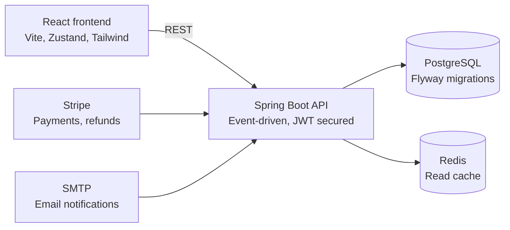

# Reservation System — Backend

This repository contains the Spring Boot API and event-driven architecture for the venue & stall reservation system.

A Spring Boot backend for managing venues, halls, floor layouts, and stall reservations — from stall/pricing setup to reservation, payment (Stripe), settlement, and notifications.

## Architecture



The React frontend talks to this API over REST; the API is backed by PostgreSQL (with Flyway-managed migrations) and Redis for caching, and integrates with Stripe for payments and SMTP for transactional email.

## Tech Stack

- **Java 21**, **Spring Boot 3.3.13**
- **Spring Web**, **Spring Data JPA**, **Spring Security** (JWT, stateless)
- **PostgreSQL** (prod) / **H2** (dev, in-memory)
- **Flyway** for database migrations
- **Redis** for caching
- **Thymeleaf** for email templates
- **Stripe** for payments (checkout + webhooks)
- **MapStruct** + **Lombok** for DTO mapping and boilerplate reduction
- **ZXing** for QR code generation
- **Spring Boot Actuator + Micrometer/Prometheus** for observability
- **JJWT** for token handling

## Architecture Overview

The system is organized around a venue hierarchy and a reservation/payment pipeline:

```
Venue → Building → Floor → Hall → Stall (with LayoutMarker/LayoutPosition for grid placement)
Event → EventStall (stall pricing/availability per event) → Reservation → ReservationStall
                                                                    ↓
                                                                Payment (Stripe) → EventSettlement
```

Key domain concepts:

- **Venue hierarchy**: `Venue`, `Building`, `Floor`, `Hall`, `Stall` model the physical space; `LayoutMarker`/`LayoutPosition` support visual floor-plan layouts and auto-generated stall grids (`LayoutGenerationService`).
- **Organizations**: `Organization`, `OrganizationMember`, `OrganizationRole`, `OrganizationInvite` support multi-user organizations (e.g. publishers) with role-based capabilities that reserve stalls.
- **Events & pricing**: `Event`, `EventStall`, `PricingRule`, and a strategy-based pricing engine (`DurationPricingStrategy`, `OrgTypePricingStrategy`, `SeasonalPricingStrategy`) compute stall pricing per event.
- **Reservations**: `Reservation` and `ReservationStall` track stall bookings, with a scheduled cleanup service (`ReservationCleanupService`) for expiring unconfirmed bookings.
- **Payments & settlement**: Stripe-backed `Payment` records and webhook handling, with `EventSettlement`/`TransactionHistory` for post-event financial reconciliation.
- **Auth & security**: JWT-based stateless auth (`JwtService`, `JwtAuthenticationFilter`), refresh tokens, rate limiting (`RateLimitingFilter`), login-attempt tracking, PII field encryption (`PiiEncryptionConverter`), and role-based access control via Spring Security method security.
- **Notifications**: Email notifications (verification, password reset, reservation status, org events) via Thymeleaf templates and an async, event-driven `NotificationEventListener`.
- **Domain events**: An internal Spring application-event system (`event/` package) drives cache eviction, auditing, notifications, and cascading deactivation across the venue hierarchy (e.g. deactivating a `Venue` cascades to `Building` → `Floor` → `Hall`).

## Project Structure

```
src/main/java/com/bookfair/backend/
├── Model/            # JPA entities
├── config/            # Security, CORS, cache, async, scheduling, Stripe config
├── controller/         # REST controllers
├── dto/                # Request/response DTOs + MapStruct mappers, grouped by domain
├── event/              # Domain/application events (cache, hierarchy, reservation, payment, user...)
├── listener/           # Event listeners (audit, cache eviction, notifications, security)
├── exception/          # Custom exceptions + global exception handler
├── integration/        # External integrations (Stripe payment gateway, email channel)
├── repository/         # Spring Data JPA repositories
├── security/           # JWT service, auth entry point, org-level security evaluator
├── service/            # Business logic, including pricing strategies
└── converter/          # JPA attribute converters (PII encryption)

src/main/resources/
├── application*.properties   # Base / dev / prod configuration
├── db/migration/              # Flyway migration scripts
└── templates/email/           # Thymeleaf email templates
```

## API Overview

All endpoints are versioned under `/api/v1` (except Stripe webhooks under `/api/payments`).

| Base path | Responsibility |
|---|---|
| `/api/v1/auth` | Register, login, refresh, email verification, password reset (public) |
| `/api/v1/users` | User profile and account management |
| `/api/v1/organizations`, `/api/organizations/invites` | Organizations, membership, invites |
| `/api/v1/venues`, `/api/v1/buildings`, `/api/v1/floors`, `/api/v1/halls`, `/api/v1/stalls` | Venue hierarchy CRUD |
| `/api/v1/layout`, `/api/v1/layout-markers` | Floor-plan layout and stall grid generation |
| `/api/v1/events`, `/api/v1/event-stalls` | Events and per-event stall configuration |
| `/api/v1/genres` | Book genre management |
| `/api/v1/pricing` | Pricing rules and price breakdown calculation |
| `/api/v1/reservations` | Stall reservations |
| `/api/v1/payments`, `/api/payments` (webhook) | Payment processing and Stripe webhooks |
| `/api/v1/admin` | Admin dashboard and system configuration |

Auth endpoints and `/actuator/health` are public; all other endpoints require a valid JWT, and `/actuator/**` (beyond health) requires the `SUPER_ADMIN` role.

## Getting Started

### Prerequisites

- Java 21
- Maven (or use the bundled `./mvnw`)
- Redis (for caching — required at runtime)
- A Stripe account (test keys are sufficient for local development)
- PostgreSQL (only required for the `prod` profile — `dev` uses in-memory H2)

### Configuration

The app reads configuration from environment variables, with dev-friendly defaults in `application.properties` / `application-dev.properties`. At minimum, set:

```bash
export JWT_SECRET=your-jwt-secret
export STRIPE_SECRET_KEY=sk_test_...
export STRIPE_WEBHOOK_SECRET=whsec_...
export SMTP_PW=your-gmail-app-password
```

Optional overrides (defaults shown):

| Variable | Default | Purpose |
|---|---|---|
| `SPRING_PROFILES_ACTIVE` | `dev` | Active Spring profile (`dev` / `prod`) |
| `DB_URL` / `DB_USER` / `DB_PASSWORD` | H2 in-memory | Database connection (use PostgreSQL for `prod`) |
| `CORS_ORIGINS` | `http://localhost:5173` | Allowed frontend origin(s) |
| `PII_SECRET_KEY` | dev default | Key for encrypting PII fields — override in any real deployment |
| `H2_CONSOLE_ENABLED` | `true` (dev) | Toggle the H2 web console at `/h2-console` |

The `prod` profile enforces SSL on the database connection, disables the H2 console, and disables SQL logging.

### Running the Application

There are two main ways to run this application:

#### Option 1: Run the Full Stack with Docker Compose (Recommended)
This method spins up the complete environment, including the Spring Boot API, the React Frontend (from the sibling `Reservation_System_Frontend` directory), PostgreSQL, Redis, Kafka, and the full monitoring stack (Grafana, Prometheus, Loki, Tempo).

1. Navigate to the backend directory:
   ```bash
   cd Reservation_System
   ```
2. Start the stack in the background:
   ```bash
   docker compose up -d --build
   ```
   *(Note: If you encounter network timeouts downloading images, run `docker compose pull` first, then try again).*

Once everything is running:
- **Frontend**: http://localhost:5173
- **Backend API**: http://localhost:8080
- **Grafana (Monitoring)**: http://localhost:3000

#### Option 2: Run the Backend Locally for Development
If you prefer to run the backend natively using the in-memory H2 database (avoiding the heavy Postgres/monitoring stack), you can do so using the `dev` profile.

1. **Start Redis**:
   The API requires Redis for caching. Start a temporary Redis container:
   ```bash
   docker run -d -p 6379:6379 redis:7-alpine
   ```

2. **Run the Spring Boot Application**:
   Using the bundled Maven wrapper:
   ```bash
   # Linux / macOS
   ./mvnw spring-boot:run
   
   # Windows
   .\mvnw.cmd spring-boot:run
   ```

The API will be available at `http://localhost:4000` (port `4000` is the default for the `dev` profile).

### Running Tests

```bash
./mvnw test
```

## Notable Implementation Details

- **Cascading deactivation**: Deactivating a `Venue`/`Building`/`Floor`/`Hall` publishes domain events that cascade deactivation down the hierarchy rather than requiring manual cleanup at each level.
- **Pricing engine**: Uses the Strategy pattern so new pricing rules (seasonal, duration-based, organization-type-based) can be added without modifying existing calculation logic.
- **Reservation expiry**: A scheduled service automatically expires reservations that aren't confirmed within the allowed window, freeing up stalls.
- **PII encryption**: Sensitive fields are transparently encrypted/decrypted at the JPA layer via a custom `AttributeConverter`.
- **Rate limiting**: A dedicated filter applies rate limiting after JWT authentication, to protect authenticated endpoints from abuse.
